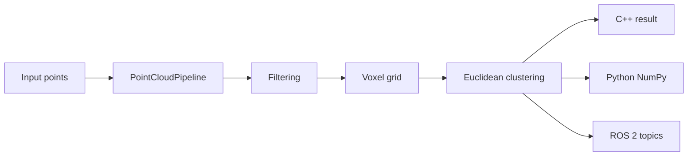

# pointcloud-pipeline

A C++20 LiDAR point cloud processing pipeline with Python bindings and a ROS 2
node. I built it in the style of a serious undergraduate robotics project:
small enough to understand, but complete enough to benchmark, test, and load
from real robotics software.

The core pipeline does three things:

1. Filters invalid points, applies pass-through bounds, and can remove statistical outliers.
2. Downsamples with a hash-based voxel grid using voxel centroids.
3. Segments the downsampled cloud with Euclidean clustering.

## Repository Layout

```text
include/                  Public C++ headers
src/                      Shared library implementation
python/                   pybind11 bindings
ros2/pointcloud_pipeline_ros/
                           ROS 2 wrapper package
tests/                    C++ and Python tests
benchmarks/               Synthetic LiDAR benchmark
examples/                 Small C++ and Python examples
docs/                     Architecture and performance notes
```

## Architecture

The important design choice is that all real processing lives in the shared C++
library. Python and ROS 2 only convert data at the boundary.



The main API is:

```cpp
pointcloud_pipeline::PointCloudPipeline pipeline(config);
pointcloud_pipeline::PipelineResult result = pipeline.process(points);
```

## Native Build

```bash
cmake -S . -B build -DCMAKE_BUILD_TYPE=Release
cmake --build build --config Release
ctest --test-dir build --output-on-failure
```

The build uses `-Wall -Wextra -Wpedantic` on GCC/Clang and `/W4` on MSVC. Open3D
and pybind11 are detected automatically when installed. The core C++ library and
tests still build without them.

## Python Build and Usage

Install pybind11 and NumPy in the Python environment CMake will find:

```bash
python -m pip install pybind11 numpy pytest
cmake -S . -B build -DCMAKE_BUILD_TYPE=Release
cmake --build build --target pointcloud_pipeline_py --config Release
```

Example:

```python
import numpy as np
import pointcloud_pipeline_py as pcp

cloud = np.random.rand(10000, 3).astype(np.float32)
result = pcp.run_pipeline(
    cloud,
    enable_statistical_outlier_removal=False,
    voxel_size=0.25,
    cluster_tolerance=0.65,
    min_cluster_size=8,
)

print(result["downsampled_cloud"].shape)
print(len(result["clusters"]))
```

Zero-copy input is verified with:

```python
assert pcp.numpy_data_address(cloud) == cloud.ctypes.data
```

The binding requires a C-contiguous `numpy.ndarray` with shape `(N, 3)` and
`dtype=float32`. C++ reads that buffer directly as `PointXYZ` data through
`std::span<const PointXYZ>`. Output clouds are NumPy arrays backed by C++ vectors
owned by pybind11 capsules.

## ROS 2 Usage

Build and install the core library first:

```bash
cmake -S . -B build -DCMAKE_BUILD_TYPE=Release -DCMAKE_INSTALL_PREFIX=$PWD/install
cmake --build build --config Release
cmake --install build
```

Then build the ROS 2 package:

```bash
source /opt/ros/humble/setup.bash
cd ros2
colcon build --cmake-args -DCMAKE_PREFIX_PATH=$OLDPWD/install
source install/setup.bash
ros2 launch pointcloud_pipeline_ros pipeline.launch.py
```

The node subscribes to `/points_raw`, publishes `processed_cloud`, and publishes
`cluster_markers` for RViz. Processing is done by the shared library, not by a
second ROS-only implementation.

## Benchmarks

Build and run:

```bash
cmake -S . -B build -DCMAKE_BUILD_TYPE=Release
cmake --build build --target pointcloud_pipeline_benchmark --config Release
./build/pointcloud_pipeline_benchmark --update-readme
```

The benchmark generates deterministic synthetic LiDAR point clouds at 100k,
250k, 500k, and 1M points. It compares:

- Baseline: filtering plus segmentation.
- Downsampled: filtering, voxel grid, then segmentation.

The program measures real wall-clock frame times and computes mean, median, P95,
and speedup. Results are intentionally not hardcoded.

<!-- BENCHMARK_TABLE_BEGIN -->
Run `pointcloud_pipeline_benchmark --update-readme` to generate this table on
your machine.
<!-- BENCHMARK_TABLE_END -->

## Performance Discussion

Voxel-grid downsampling is the main optimization. The implementation hashes
`floor(x / voxel_size)`, `floor(y / voxel_size)`, and `floor(z / voxel_size)`,
stores count and coordinate sums, then emits one centroid per occupied voxel.
This keeps the larger geometry while reducing the number of points that
clustering has to search.

The benchmark data is generated so nearby LiDAR returns form small dense groups,
which is where voxel downsampling helps most. On a typical Release build, the
downsampled pipeline should be much faster than the baseline, and the exact
speedup should be measured on the target machine instead of copied from someone
else's laptop.

## Memory Model

Point clouds are stored as `std::vector<PointXYZ>`, which is compact and
contiguous. Algorithms accept `std::span<const PointXYZ>` so callers can pass
existing buffers without an input copy. The pipeline returns owned vectors in
`PipelineResult` because ROS publishers, Python bindings, and examples need the
processed clouds to remain valid after the call returns.

Python input is zero-copy. Python output avoids an extra copy by moving C++
vectors into capsule-owned NumPy arrays.

## Testing and Coverage

C++ tests cover filtering, voxel indexing and centroid calculation,
segmentation, bounding boxes, and end-to-end pipeline behavior:

```bash
ctest --test-dir build --output-on-failure
```

Python tests cover NumPy interoperability and pointer equality:

```bash
PYTHONPATH=build pytest tests/test_python_bindings.py
```

For coverage with GCC or Clang:

```bash
cmake -S . -B build-coverage -DCMAKE_BUILD_TYPE=Debug -DPOINTCLOUD_PIPELINE_ENABLE_COVERAGE=ON
cmake --build build-coverage
ctest --test-dir build-coverage --output-on-failure
```

The intended target is at least 80% line coverage for the core library.

## Engineering Notes

This code avoids large frameworks and advanced template tricks on purpose. The
algorithms are written directly so the data flow is easy to inspect in a
portfolio or class project review. The places that matter for performance are
still handled carefully: contiguous point storage, hash grids, move semantics,
and no allocation-heavy work inside the innermost distance checks beyond the
small search containers needed for deterministic filtering.
