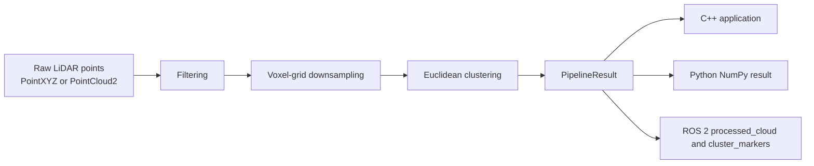
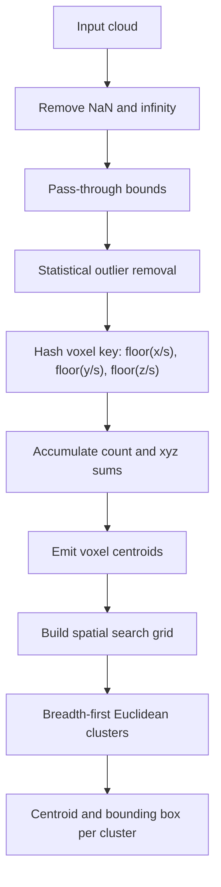
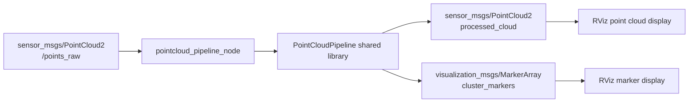
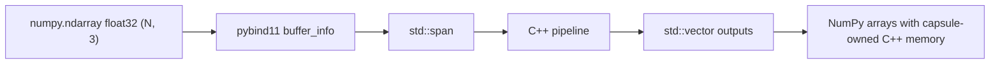

# Architecture

This project is organized around one reusable C++ shared library. The ROS 2 node
and Python module both call the same library code, so there is only one version
of the filtering, downsampling, and clustering logic to maintain.

## Data Flow

## Processing Pipeline

## ROS 2 Integration

The ROS package does message conversion and visualization only. Processing stays
inside the shared library, which makes the same code usable from offline C++,
Python, and ROS 2.

## Python Binding Architecture

Input is zero-copy when the array is C-contiguous `float32` with shape `(N, 3)`.
The binding reads the raw buffer pointer and creates a `std::span<const PointXYZ>`
over that memory. Output clouds are backed by C++ vectors owned by a pybind11
capsule, so Python can read them as NumPy arrays without a second output copy.

## Main Files

- `include/pointcloud_pipeline/types.hpp`: simple data structures.
- `src/filtering.cpp`: invalid point removal, pass-through filtering, and
  statistical outlier removal.
- `src/voxel_grid.cpp`: hash-based voxel indexing and centroid downsampling.
- `src/segmentation.cpp`: grid-accelerated Euclidean clustering.
- `python/bindings.cpp`: pybind11 module.
- `ros2/pointcloud_pipeline_ros/src/pipeline_node.cpp`: ROS 2 wrapper node.
