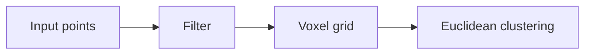

# Architecture Notes

The core rule is that filtering, voxel downsampling, and clustering live in the
shared C++ library. Python and ROS should only adapt data at the boundary.

```mermaid
flowchart LR
    A[Input points] --> B[Filter]
    B --> C[Voxel grid]
    C --> D[Euclidean clustering]
```